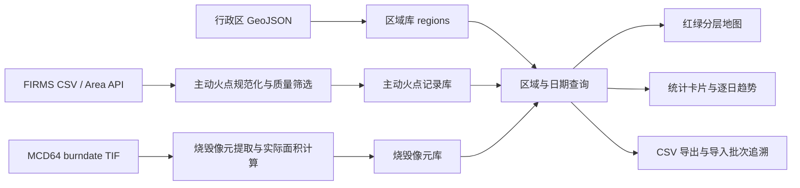

# 技术路线与功能边界

## 1. 目标

软件名称暂定为“黑龙江省火点数据检测与风险评估平台 V1.0”。

系统面向已有时相数据的本地分析：用户自行从官方渠道下载主动火点和火烧迹地数据并提交，平台完成文件校验、空间处理、数量/面积计算、分区统计、制图、导出和规则型等级分析。正式版内置经核验的黑龙江行政区边界；当前真实验证资料覆盖黑龙江五市，架构不把五个城市写死。

## 2. 为什么选 Python + Flask + SQLite + GDAL/OGR

| 备选 | 结论 | 事实依据 |
|---|---|---|
| Python + Flask + SQLite + GDAL/OGR + 原生网页 | 采用 | 现有五市网页原型已用 Flask 运行；现有计算链为 Python、Pandas、GDAL/OGR、GeoJSON、TIF 和 CSV；SQLite 适合单机软著交付。 |
| Python + PySide6 桌面端 | 备选包装层 | 水稻软著项目已成功使用，但地图交互和在线接口仍需嵌入网页或 QWebEngine；首版直接沿用浏览器界面可减少重复开发。 |
| Python + FastAPI + Vue | 后续可升级 | 适合多人、复杂前端和长期在线服务，但当前要增加 Node 构建、前后端部署及维护成本，不能提高 TIF/空间统计的科学性。 |
| Java / 小程序 | 不作为 v1.0 | 当前没有对应的 Java 或移动端实现、数据处理链与部署条件，写入首版会造成源码和说明不对应。 |

技术选择的原则不是“框架越多越好”，而是确保每一个写入软著的功能都有本地可运行代码、可展示界面、可复算数据和可追溯文件。

## 3. 系统数据流

## 4. v0.1 已实现功能边界

| 模块 | 已实现行为 | 代码位置 |
|---|---|---|
| 边界管理 | 导入 GeoJSON；支持按字段拆分多个区域或将多个区县合并成一市 | `core/geography.py`、`services/import_service.py` |
| 主动火点 | 导入 FIRMS CSV；按 VIIRS/MODIS 规则筛选；默认通过区域边界分配城市，也可显式使用同版本边界已赋值的城市列 | `core/firms.py` |
| 官方在线接口 | 通过后端读取 `FIRMS_MAP_KEY` 并按 5 天分段调用 Area API | `core/firms.py`、`main.py` |
| 火烧迹地 | 从经纬度 MCD64 `burndate` TIF 提取正值像元、日期、面积和可选 QA 值 | `core/mcd64.py` |
| 数据管理 | SQLite 保存边界、主动火点、烧毁像元、导入批次和来源信息 | `storage/database.py` |
| 查询与导出 | 区域/日期条件查询、逐日汇总、CSV 导出、地图数据接口 | `app.py` |
| 页面 | 红色主动火点、绿色烧毁像元分层显示；状态、统计、逐日表和导出 | `templates/index.html`、`static/` |

## 5. 后续功能只能在实现后写入软著

以下功能具有实际价值，但 v0.1 尚未实现，不能描述为当前软件已具备：

1. 用户账户、角色权限和多人协作；
2. 自动定时下载、重试、告警推送；
3. 基于时空阈值的独立焚烧事件聚类；
4. PostgreSQL/PostGIS 多用户数据库；
5. 卫星真彩图、作物分类、秸秆焚烧判别模型；
6. 手机小程序或移动端。

这些内容应作为 v1.1/v2.0 的开发任务，完成代码、测试、界面和演示数据后再进入新版软著材料。
